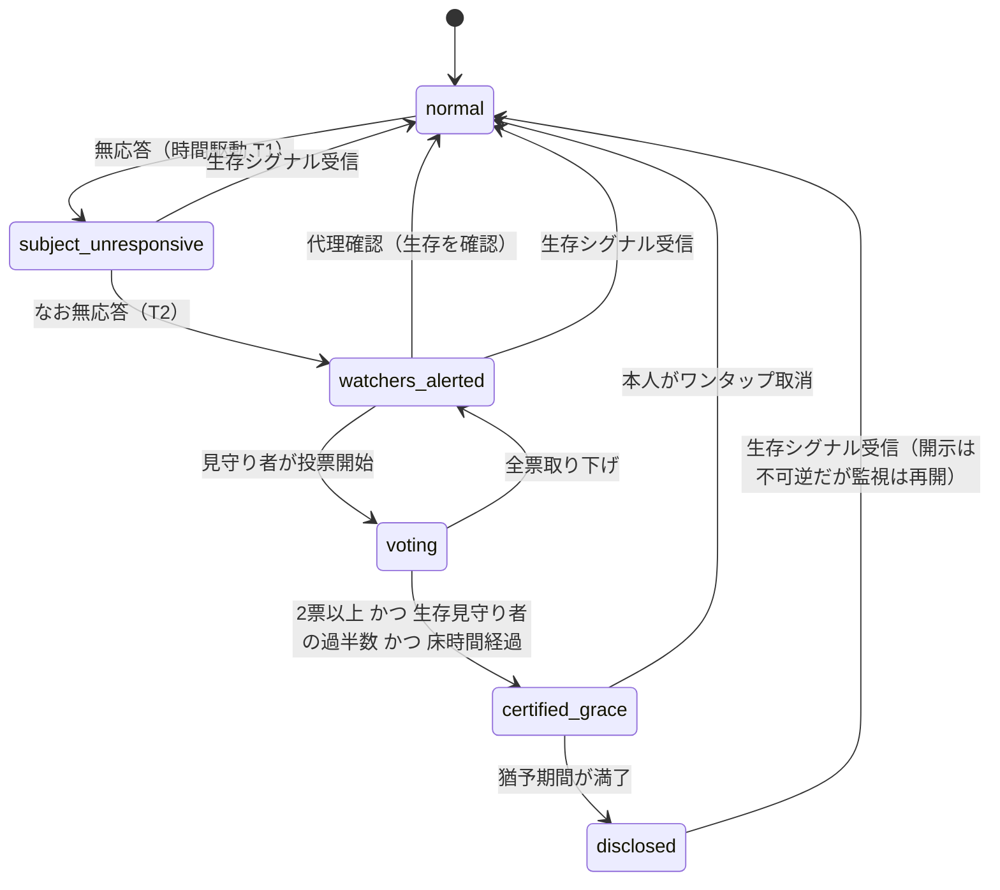
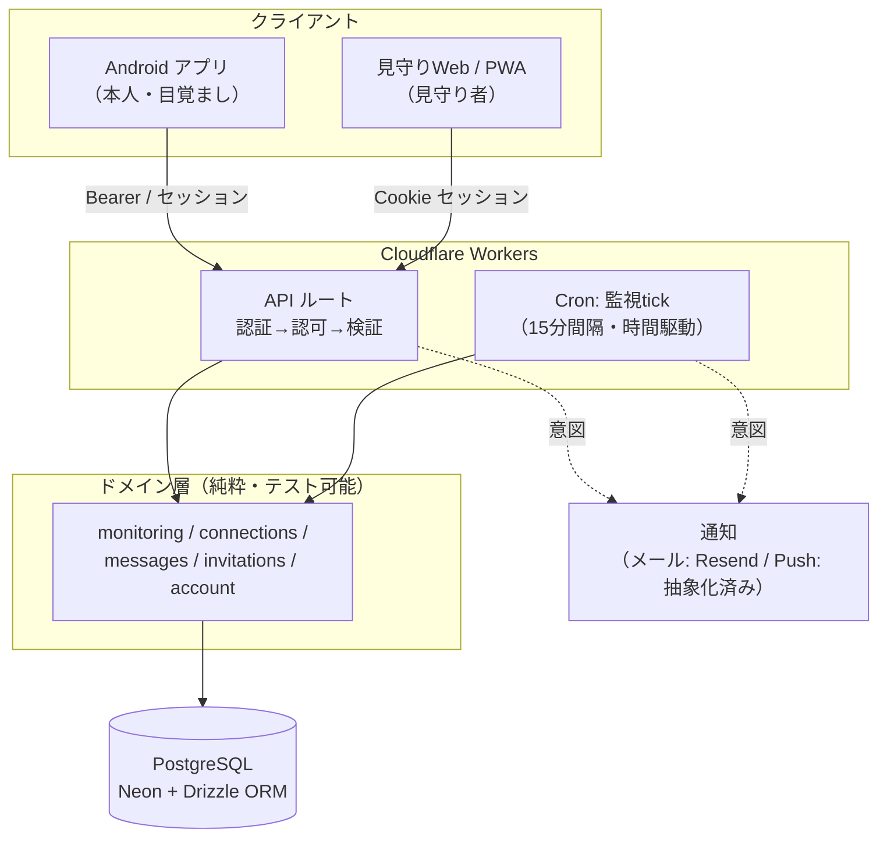

# アサトモ（Asatomo）

> 目覚ましを止めるだけで、離れて暮らす大切な人に「今日も元気」がそっと伝わる。
> 単身者どうしがゆるく見守り合い、もしものときには最後の伝言を託せる見守りサービス。

**本番環境**: https://asatomo.nafuda.me

<p>
  
  
  
  
  
  
  
</p>

---

## この README について

これは**個人開発プロダクトのポートフォリオ**です。単なる機能一覧ではなく、
**「なぜその設計にしたか」という意思決定とトレードオフ**を中心にまとめています。
実装の詳細な根拠は [`docs/adr/`](docs/adr/)（11本の Architecture Decision Record）と
ドメイン用語集 [`CONTEXT.md`](CONTEXT.md) に記録しており、コードと文書が一貫するよう保っています。

- **規模**: アプリケーションコード 約 11,500 行 / テスト 146 ケース（約 3,000 行）
- **形態**: ネイティブ Android アプリ（本人の日常の道具）＋ Web アプリ（見守り者の面）の2面構成
- **役割**: 企画・ドメイン設計・実装・テスト・インフラ・運用まで一人で担当

---

## 何を解決するプロダクトか

一人暮らしの高齢者・単身者が増える中、「孤独死」と「見守りの重さ」はトレードオフの関係にあります。
毎日の安否確認は、する側・される側の双方に負担で、監視感が強いと続きません。

アサトモは、 **本人が毎朝アラームを止めるという“ただの目覚まし”の操作** を生存シグナルに変え、
見守る側には **「今この瞬間を覗く」のではなく「最後にいつ元気だったか」だけ** を、過去形・粗い粒度で見せます。
監視感を消し、「ゆるく知っている安心」だけを残す設計です。

さらに、万一のときには **本人が生前に暗号化して託した「最後の伝言」** が、
複数の見守り者の人間判断を経て受取人へ届きます。

---

## エンジニアリング上の見どころ

### 1. ゼロ知識のエンドツーエンド暗号（最後の伝言）

「死後に届く伝言」は、運営者が中身を読めてはならない究極の機微情報です。
**サーバは暗号文・IV・ラップ済み鍵しか持たず、平文も鍵も一切保持しません**（ゼロ知識）。

- 本文を **AES-GCM 256bit** の DEK（Data Encryption Key）で暗号化
- DEK を**受取人ごとの合言葉**由来鍵で個別にラップ（**PBKDF2 200,000回 / SHA-256**、ランダム salt/IV）
- DEK を**本人の編集用パスワード**でもラップ（生前の読み返し用）＝ マルチラップ構造
- 暗号化・復号はすべて**ブラウザ内の Web Crypto API**で完結（[`src/web/crypto.ts`](src/web/crypto.ts)）

合言葉は「その受取人だけが知っていること」を使う想定で、**生前の事前共有を不要**にしています。
運営者は合言葉を持たないため、原理的に復元不可能——これを機能ではなく仕様として明示しました
（詳細: [ADR-0002](docs/adr/0002-final-message-encryption-key-custody.md)）。

### 2. 人間の判断を介在させる死亡認定ステートマシン

単純なタイムアウト型デッドマンズスイッチは**誤爆**（生きているのに伝言が開示される）が致命的です。
アサトモは時間駆動と**見守り者の人間判断**を組み合わせた多段防御で誤爆を防ぎます。



- **不変条件を明示的に守る**: 「最低2人の独立見守り者」「開示には生存見守り者2人以上（不変条件D）」など、
  安全性の要をコード横断の不変条件として定義し、承諾・解除・削除のたびに再計算
- **楽観的更新で原子性を担保**: `WHERE` ガード付き `UPDATE ... RETURNING` により、
  並行する二重投票・二重承諾を**空振りで安全に**処理（明示トランザクション非依存）
- **「端末操作 ≠ 本人性」を織り込む**: シグナルは偽造しうる前提に立ち、本人性の担保は
  暗号ではなく**見守り者の人間判断**に負わせる、と設計段階で線引き
  （詳細: [ADR-0001](docs/adr/0001-death-certification-authorization-model.md)）

### 3. イベント駆動と時間駆動を分離したドメイン設計

ロジックを**純粋なドメイン層**（DB 操作のみ・副作用なし・テスト可能）に集約し、
その周りを薄く配線しています。通知などの副作用はドメインが「意図」を戻り値で返し、
ルート層が実行する——という一貫した規約でテスト容易性を最大化しました。



- **状態遷移の駆動を2系統に分離**: 即時のイベント（シグナル・投票）は API ハンドラ、
  時間経過（無応答の段階進行・開示）は 15 分間隔の **Cron Trigger** が担当
- **認可はドメイン層に集約**: 全ミューテーションを `subjectUserId = actor` にスコープし、
  見守り者アクションは「承諾済み見守り者か」を都度検証（IDOR を構造的に排除）

### 4. 設計を文書に残す — ADR とユビキタス言語

一人開発でも**将来の自分と読み手のために意思決定を残す**ことを重視しました。

- **11本の ADR**: 「なぜソフト削除にしないか」「なぜ通知は非対称か」など、
  一度悩んだ判断を背景・トレードオフごと記録
- **ユビキタス言語 ([`CONTEXT.md`](CONTEXT.md))**: 「本人／見守り者／受取人」など、
  一字違いで逆の意味になる用語を厳密に定義し、UI コピーの言い換え規則まで統一
- **自己主導のセキュリティレビュー**: 認可・暗号・XSS・オープンリダイレクト・秘密情報の扱いを
  定期的に点検（直近ではリダイレクト検証のバックスラッシュ回避を検出・修正）

---

## 技術スタック

| 領域 | 採用技術 | 選定理由 |
|---|---|---|
| 言語 | **TypeScript** | フロント・バック・ドメインを型で一気通貫にし、リファクタ耐性を確保 |
| Web フレームワーク | **TanStack Start**（React 19 / SSR / ファイルベースルーティング） | サーバー関数と型付きルーターで、認証状態に応じた SSR を簡潔に |
| 実行環境 | **Cloudflare Workers**（`nodejs_compat`） | エッジで低レイテンシ・低運用コスト。Cron Trigger で監視tickも同居 |
| 認証 | **Better Auth**（Google / Facebook / LINE OAuth・Bearer） | セッションと OAuth を薄く自前所有。Android はネイティブ取得の ID トークンを渡す |
| DB / ORM | **PostgreSQL (Neon)** + **Drizzle ORM** | 型安全なクエリ。マイグレーションは drizzle-kit で管理 |
| 入力検証 | **Zod** | API 境界で検証と型変換（JSON 文字列→Date）を一元化 |
| 暗号 | **Web Crypto API**（AES-GCM / PBKDF2） | 追加ライブラリ無しでブラウザ内ゼロ知識暗号を実現 |
| 通知 | **Resend**（メール・稼働中）/ Push は抽象化済み（FCM 配線は準備中） | 送信チャネルをインターフェースで分離し差し替え・テスト可能に |
| テスト | **Vitest** + **PGlite**（インメモリ Postgres） | 実 DB 相当の統合テストを CI で高速・決定論的に |
| 品質 | **Biome**（lint / format） | 単一ツールで高速に統一 |
| モバイル | **Android ネイティブ（Kotlin / Gradle）** | 目覚まし・バックグラウンド動作など本人の日常の道具はネイティブで |

---

## テスト

ドメインロジックの正しさが**人命に関わる**プロダクトのため、テストを重視しています。

- **146 テストケース / 13 ファイル**（約 3,000 行）
- **PGlite** による統合テストで、状態機械・クォーラム判定・暗号往復・認可・通知意図を実 DB 相当で検証
- 誤爆防止の要（不変条件 A/B/D・投票の過半数・猶予・本人取消・旅行モードの自動再開など）を網羅

```bash
npm test          # Vitest（PGlite 統合テスト）
npm run typecheck # tsc --noEmit
npm run lint      # Biome
```

---

## プロジェクト構成

```
src/
├─ api/        # HTTP 境界: ルーティング・認証解決・入力検証（Zod）・認可
├─ domain/     # ドメイン層（純粋・副作用なし・テスト可能）
│              #   monitoring / connections / messages / invitations / account / queries
├─ notify/     # 通知（宛先解決 + 送信チャネルの抽象化）
├─ cron/       # 監視tick（時間駆動の状態遷移）
├─ routes/     # TanStack Start ルート（SSR・公開/認証ページ・API エンドポイント）
├─ web/        # クライアント: 暗号・開示 UI・PWA・ナビ
├─ db/         # Drizzle スキーマ
└─ server/     # Workers エントリ・環境変数・リクエストごとの依存組み立て

docs/adr/      # Architecture Decision Records（11本）
docs/design/   # 設計メモ（死亡認定フロー等）
CONTEXT.md     # ユビキタス言語（ドメイン用語集）
android/       # Android ネイティブアプリ（Kotlin / Gradle）
test/          # Vitest + PGlite 統合テスト
```

---

## ローカル開発

```bash
npm install
cp .env.example .env   # DATABASE_URL / BETTER_AUTH_SECRET / OAuth クレデンシャル等を設定
npm run db:migrate     # スキーマ適用
npm run dev            # Vite 開発サーバー
```

デプロイは Cloudflare Workers へ:

```bash
npm run deploy         # build:cf → wrangler deploy
```

> シークレット（`DATABASE_URL` / `BETTER_AUTH_SECRET` / OAuth / `EMAIL_API_KEY` 等）は
> `wrangler secret put` で登録します。開発専用の認証バイパスは本番に設定しません。

---

## 設計判断のハイライト（ADR 抜粋）

| ADR | 判断 | トレードオフ |
|---|---|---|
| [0001](docs/adr/0001-death-certification-authorization-model.md) | 死亡認定は人間判断＋多段防御 | 即時性を犠牲にしても誤爆をゼロに寄せる |
| [0002](docs/adr/0002-final-message-encryption-key-custody.md) | ゼロ知識・合言葉方式 | 合言葉紛失＝復元不可を仕様として受容 |
| [0007](docs/adr/0007-account-deletion-model.md) | 即時・不可逆のハード削除 | 復元性ではなく「情報つきの摩擦」で誤削除を防ぐ |
| [0011](docs/adr/0011-recipient-disclosure-access-and-unit.md) | 公開開示ルートは推測不能 ID ＋状態ゲート＋中立404 | ログイン不要と、存在の秘匿を両立 |

---

## ライセンス

個人開発・非公開プロダクト（ポートフォリオ公開用）。コードの再利用については著者までご相談ください。
